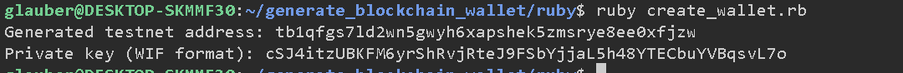
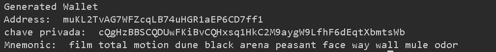

# Generate Blockchain Wallet

This readme file provides instructions on how to run the Ruby and JavaScript versions of the code to generate a testnet Bitcoin address. It also includes steps to add funds to the generated address and view the results.

## Ruby Version

To run the Ruby version of the code, follow these steps:

1. Install Ruby on your machine if it is not already installed.
2. Open a terminal and navigate to the directory where the code is located.
3. Run the following command to install the required dependencies:
  ```
  cd ruby
  bundle install
  ```
4. Execute the Ruby script using the following command:
  ```
  ruby generate_wallet.rb
  ```
5. The script will generate a testnet Bitcoin address and display it on the console.
Example:


## JavaScript Version

To run the JavaScript version of the code, follow these steps:

1. Ensure that Node.js is installed on your machine.
2. Open a terminal and navigate to the directory where the code is located.
3. Run the following command to install the required dependencies:
  ```
  cd javascript
  npm install
  ```
4. Execute the JavaScript script using the following command:
  ```
  node src/create_wallet.js
  or
  node src/createWallet.js
  ```
  (2 different implementations for JS)
5. The script will generate a testnet Bitcoin address and display it on the console.



## Adding Funds and Viewing Results

To add funds to the generated address and view the results, you can follow these steps:

1. Obtain some testnet Bitcoins from a testnet faucet.
2. Send the testnet Bitcoins to the generated address.
3. Wait for the transaction to be confirmed on the testnet blockchain.
4. Use a testnet blockchain explorer to view the transaction details and confirm that the funds have been added to the generated address.

That's it! You have successfully generated a testnet Bitcoin address using both the Ruby and JavaScript versions of the code. You can now add funds to the address and view the results.

Note:
```
Ruby implementation is considerably shorter and less prone to issues, compared to the javascript implementation. 
```